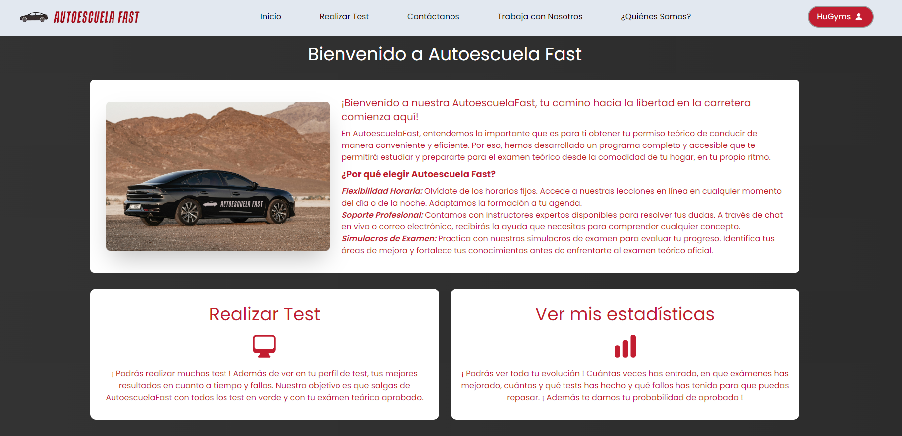

<div align="center">
    
    <h1>Bienvenidos a Autoescuela Fast</h1>
    
</div>


## ℹ️ Información sobre el proyecto.
<div>
    <p>¡Bienvenido a nuestra AutoescuelaFast, tu camino hacia la libertad en la carretera comienza aquí!</p>
    <p>En AutoescuelaFast, entendemos lo importante que es para ti obtener tu permiso teórico de conducir de manera conveniente y eficiente. Por eso, hemos desarrollado un programa completo y accesible que te permitirá estudiar y prepararte para el examen teórico desde la comodidad de tu hogar, en tu propio ritmo.</p>
</div>

## 📂 ¿Cómo usar esta aplicación?
Clonamos el repositorio:
```bash
git clone https://github.com/HuGymsForMe/ProyectoFinal2-Daw
```
Instalamos las dependencias tanto en servidor como en cliente:
```bash
cd server | npm i
```
```bash
cd client | npm i
```
Arrancamos la aplicación:
```bash
npm run dev
```

## 💻 Tecnologías utilizadas para este proyecto
- 🖥️ Stack MERN (MongoDB, Express.js, React.js, Node.js)
- 🎨 HTML, CSS (Tailwind)

## 📚 ¿Porqué este proyecto y no otro?
<div>
    <p>Este proyecto está desarrollado como trabajo final del Grado Superior de Desarrollo de Aplicaciones Web, pensé que sería buena idea trasladar mi anterior proyecto
    hecho con Python y mejorarlo, dandole otro enfoque.</p>
</div>

👉 **[Ver aplicación de escritorio del proyecto](https://github.com/HuGymsForMe/AutoescuelaFast)**
